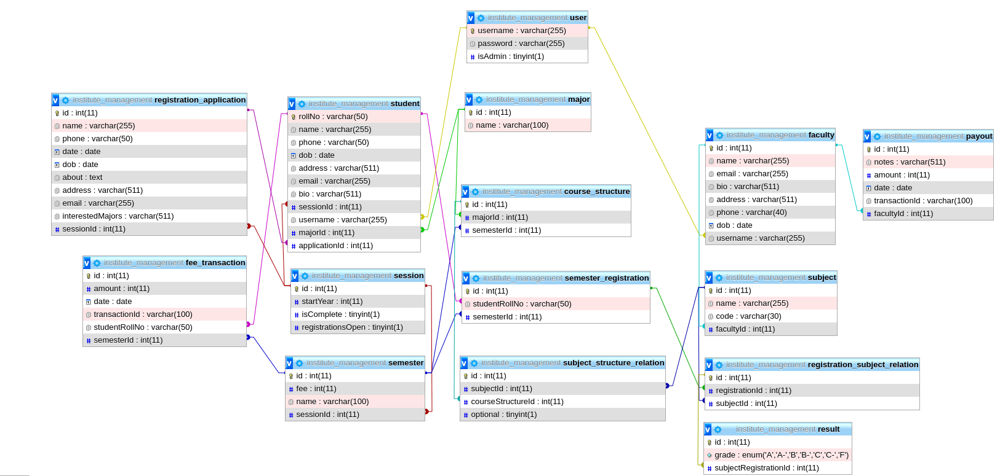

# institute-management
A web application for institute management. Submitted as my DBMS project. Made using Spring MVC framework.

## Running this project
- Run `cp .env.example .env`.
- Create a mysql database and enter its details in the `.env` file.
- Create tables in your mysql databse using the SQL queries in the `tables.sql` file.
- Create an admin user so you can use the admin portal. (That can be done by making a new user with the value of isAdmin field equal to `1`.)
- Now you can run the project using any Java IDE and use the portal.

## Relationship Schema

